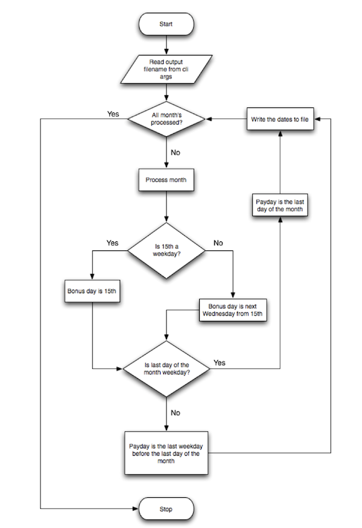

# Salary Payment Date Tool

This is a command-line utility developed for the code challenge at BAS. The tool calculates and generates salary and bonus payment dates for the remainder of year, adhering to the provided flowchart and requirements.

## Overview
The application determines:
- **Salary Payment Dates**: Paid on the last weekday of each month.
- **Bonus Payment Dates**: Paid on the 15th of each month, or the next Wednesday if the 15th is a weekend.
- Output is saved as a CSV file with columns: `Month`, `Salary Payment Date`, and `Bonus Payment Date`.

## Project Structure
- `src/`: Contains the main application logic.
- `tests/`: Houses PHPUnit test files.
- `payroll-calculator.php`: Entry point script to run the utility.
- `Dockerfile`: Defines the Docker environment with PHP 8.2 and dependencies.
- `composer.json`: Manages dependencies (Carbon, PHPUnit).

## Setup and Usage
1. Ensure Docker is installed on your system (if you want to use a dockerized version).
2. Clone or copy the project files to a directory.
3. Build the Docker image:
   ```bash
   docker build -t salary-payment-tool .
   ```
4. Run the container to generate the CSV:
   ```bash
   docker run --rm -it salary-payment-tool
   ```
   The output file `output.csv` will be generated inside the container. To save it locally, mount a volume:
   ```bash
   docker run --rm -v $(pwd)/output:/app/output salary-payment-tool
   ```
5. If you want to run the script in your local machine, and you are sure that you have all requirements:
   ```bash
   composer install
   ```
   Then run `payroll-calculator.php` like this:
   ```bash
   php payroll-calculator.php --output="./output/output.csv"
   ```
6. Check the `output.csv` file in your local `output` directory.

## Running Unit Tests
- PHPUnit is included for testing. To execute tests:
    1. if you don't have `vendor` directory please run `composer install` to create the `vendor` directory.
    2. Run the test suite:
       ```bash
       vendor/bin/phpunit tests
       ```

## Dependencies
- **PHP 8.2**: Chosen for modern features and stability.
- **Carbon**: A date manipulation library (`nesbot/carbon`) for robust date handling.
- **PHPUnit**: Testing framework (`phpunit/phpunit`) for unit tests.
- **Docker**: Ensures a consistent runtime environment.

## Why Carbon Instead of Native PHP?
### Reasoning
Native PHP's `DateTime` class is functional but lacks the intuitive API and extensive features of Carbon. For this project, precise date adjustments (e.g., finding the last weekday or next Wednesday) are critical, and Carbon simplifies these with methods like `endOfMonth()`, `previous()`, and `next()`.

### Pros
- **Ease of Use**: Simplifies complex date logic with a fluent interface.
- **Accuracy**: Handles edge cases (e.g., weekends) reliably.
- **Maintainability**: Reduces code verbosity and improves readability.

### Cons
- **Dependency**: Adds an external library, increasing setup complexity.
- **Learning Curve**: Requires familiarity with Carbon’s API.

Given the assignment's focus on showcasing skills and the need for clean, efficient code, the benefits of Carbon outweigh the cons.

## Implementation Details
- The code follows SOLID principles with separate `PayDateCalculator` and `CsvWriter` classes.

## Future Improvements
- Add input validation for custom year ranges.
- Enhance test coverage with edge cases.
- Implement error logging for production readiness.

## Notes
This is a sample implementation for evaluation purposes only, as per the assignment guidelines. No external databases or complex frameworks were used to keep it lightweight.
